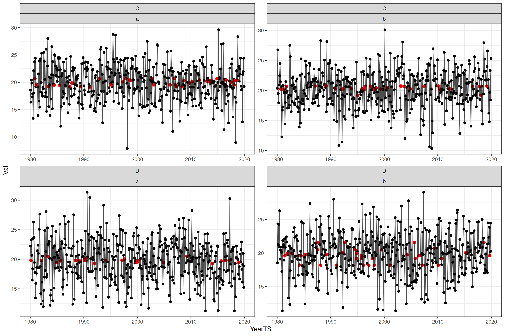
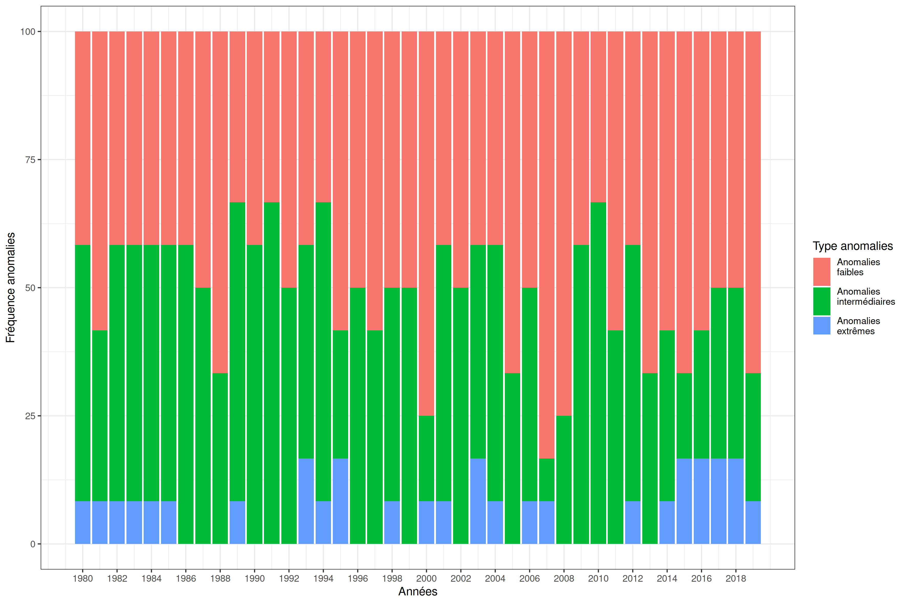
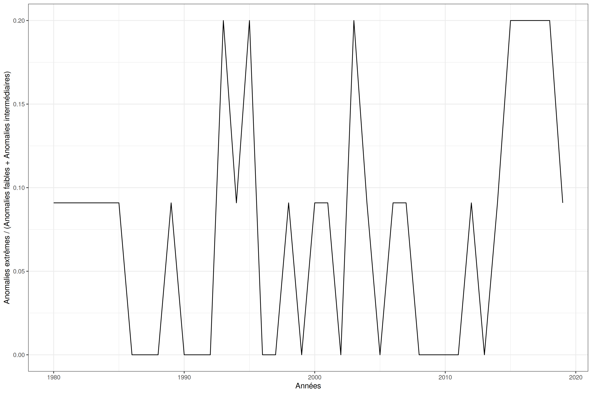
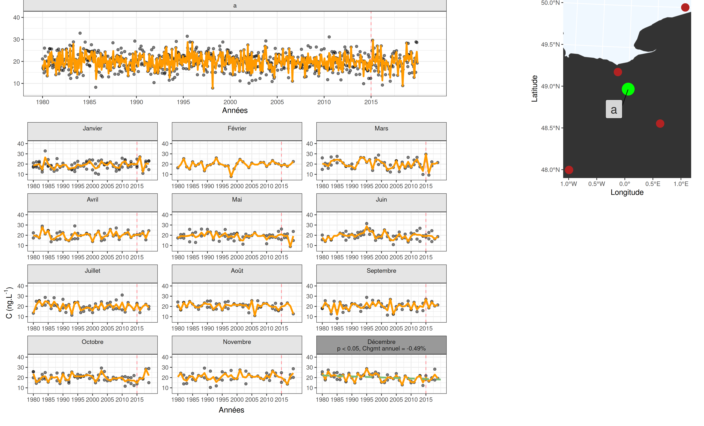
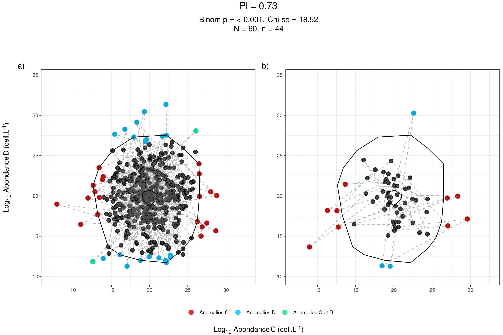
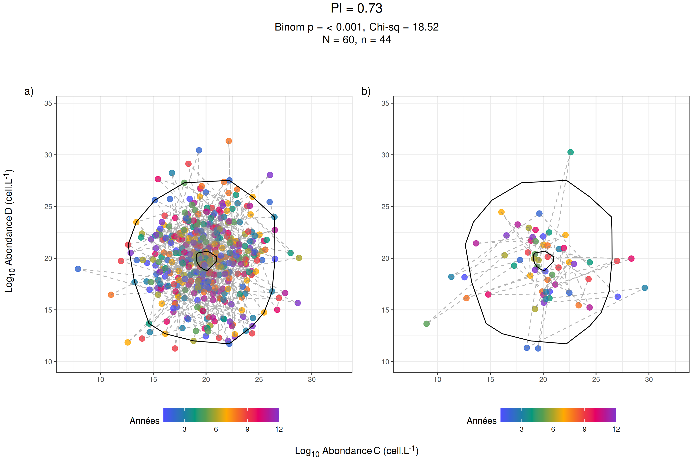
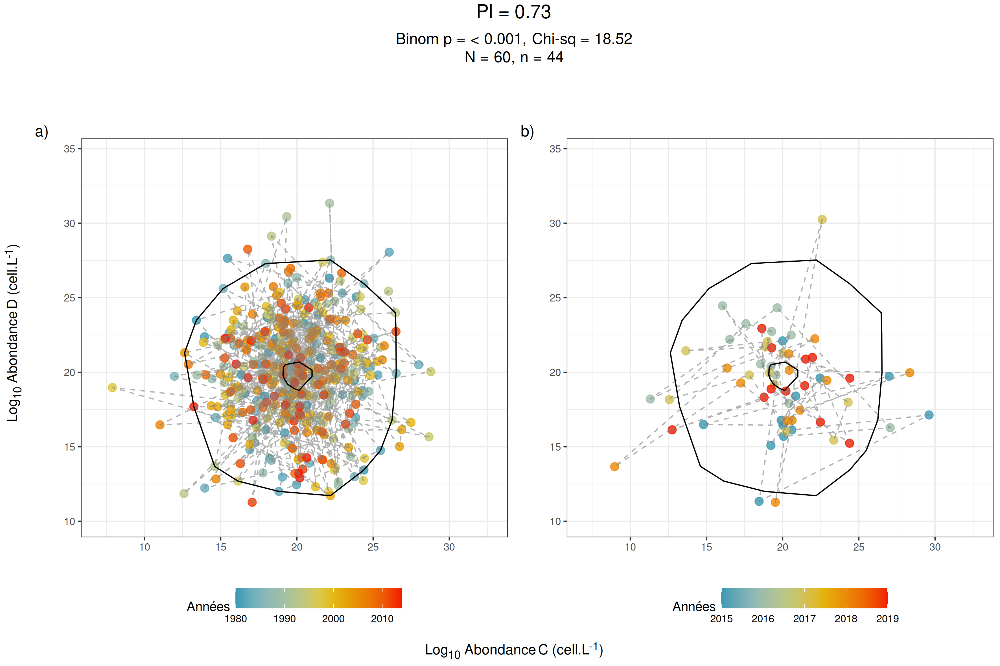

<!-- README.md is generated from README.Rmd. Please edit that file -->

```{r, include = FALSE}
knitr::opts_chunk$set(
  collapse = TRUE,
  comment = "#>",
  fig.path = "man/figures/README-",
  out.width = "100%"
)
```


<!-- badges: start -->
# HPEL.PH1

Ce package est encore en cours de développement.

The goal of HPEL.PH1 is to provide code for the MFSD Descriptor D1-Biodiversity PH1 indicators in the French Mediterranean from pygments or abundance data
<!-- badges: end -->


<!-- badges: start -->
## Installation

You can install the development version of HPEL.PH1 from [GitHub](https://github.com/) with:

``` r
# install.packages("pak")
pak::pak("arlheureux/HPEL.PH1")
library(HPEL.PH1)
```
<!-- badges: end -->


<!-- badges: start -->
## Example


```{r example}
data("data")
head(data)
tail(data)
```


``` r 
# Set path to save images
path <- "Your path"

# year min, year max, range of years and evaluation period duration
ymi = 1980
yma = 2020
ry = 1+diff(c(ymi, yma))
duree.eval <- 6

# In order to aggregate data when more than one per season (understand month in this case)
ts <- TS.agreg.UT(Data_TS = data, agg.func = 'mean', season = 1:12, year.min = ymi, year.max = yma)

# Find out what year for what parameters have less than nb.mois.min data
y <- id.year.enlever(Data_TS_month = ts, nb.mois.min = 4, nb.cores = 10)

# Remove these years from the data
rey <- remove.years(Data_TS_month = ts, Year.a.enlever = y, prop.annee.mini = .5, nb.cores = 10, range.year = ry)

# Interpolate with climatology in order to have continuous time series
int <- interpo(rey)

# Plot these TS
interpo.plot(int, name = "test", path = path)
```

{#id .class width=100% height=50%}

``` r 
# Get anoamlies of the times series
ga <- get.anomalies(data = int, year.max = yma, duree.eval = duree.eval)

# Plot them
anomalies.plot(Anomalies.R = ga$Anomalies.R, Anomalies.E = ga$Anomalies.E,
               quantiles = ga$quantiles, year.min = ymi, year.max = yma, duree.eval = duree.eval, 
               Freq.ano = ga$Freq.ano, chi2 = ga$chi2, path = path)
```

{#id .class width=100% height=50%}

``` r 
anomalies.plot.freq(Freq.ano.an = ga$Freq.ano.an, path = path)
``` 

{#id .class width=100% height=50%}
{#id .class width=100% height=50%}


``` r 
# Get seasonnal mann kendall and sen slope estimages
mks <- get.mks(Data_TS_ok = int)

# Plot them
mks.plot(Data_full = data, Data_TS = int, mks = mks, Data_full_UT = data, Data_TS_UT_ok = int, res.mks.UT = mks,
         col.param = 4, path = path, melt = F, ds = "test", groupe = "test", 
         year.max = yma)
``` 
{#id .class width=100% height=50%}
``` r 
# Calculate and plot Plankton Index
global.PI(Data_TS_ok = int, GF1 = "A", GF2 = "B", duree.eval = duree.eval, 
          year.max = yma, path = path)
```
{#id .class width=100% height=50%}
{#id .class width=100% height=50%}


{#id .class width=100% height=50%}
``` r 

```
<!-- badges: end -->
